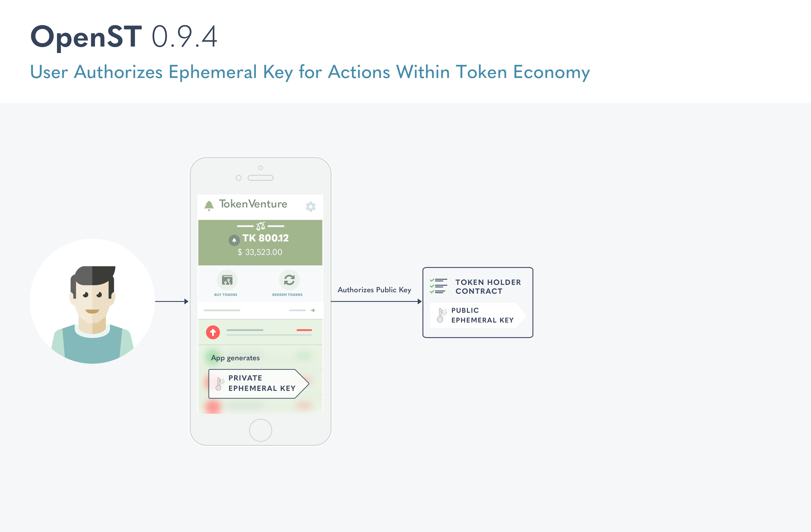
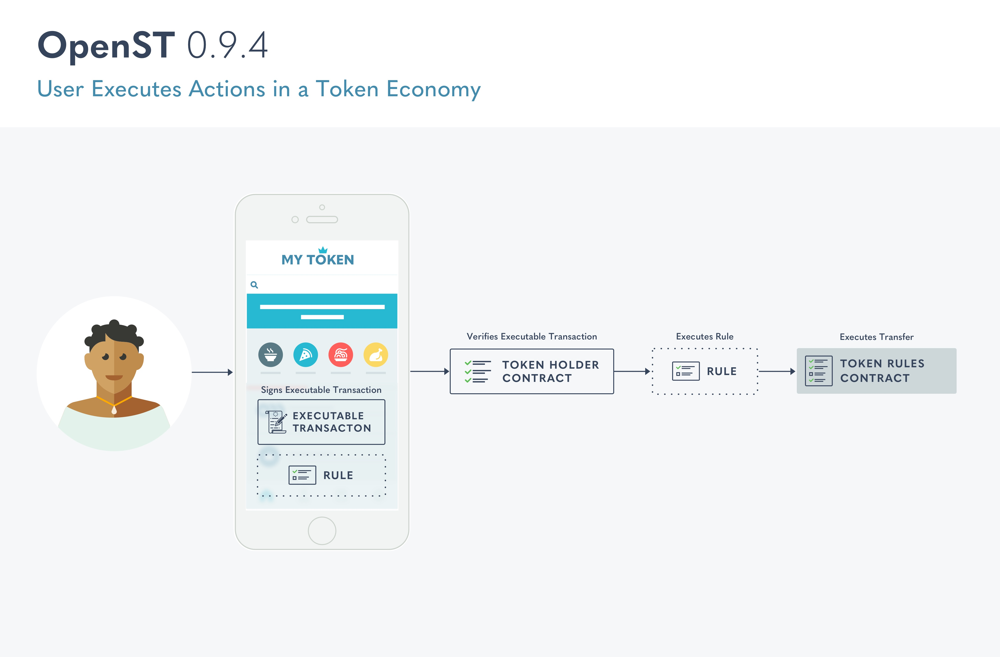

<h1 align="center">OpenST - Empowering Decentralized Economies</h1>

OpenST blockchain infrastructure empowers new economies for mainstream businesses and emerging (D)Apps. The central component of this infrastructure is the OpenST Protocol, a framework for tokenizing businesses.

_While OpenST is available as-is for anyone to use, we caution that this is early stage software and under heavy ongoing development and improvement. Please report bugs and suggested improvements._

OpenST-contracts is a collection of smart contracts that enable developers to program Token Economies.s.To participate in the discussion on technical matters, please join our [forum](https://discuss.openst.org/). The project also has a [Gitter](https://gitter.im/OpenSTFoundation/SimpleToken) channel and we track our issues in GitHub.

The major components of this repository are the TokenHolder contracts, TokenRules contract, and the custom Rule contracts that can be registered with the TokenRules contracts to establish the economy specific payments and rewards.

TokenHolder Contracts are multi-sig contracts with multiple ownership keys that are housed in different wallets that are controlled by a single human owner (say, a participant in the token economy). The multi-sig logic supports both custodial and fully decentralized key management, thus supporting a wide range of user profiles.

Ephemeral keys are introduced to sign transactions from within applications without requiring the user to manually sign every action. Ephemeral keys are temporary keys that can be authorized by the owner keys in accordance with the multi-sig requirements set by the user. 

The addition of the TokenRules contract in OpenST v0.9.4 represents the decentralization of rule design and allows apps to design on-chain rules that map to their business logic. 

Once an (d)App developer has set up their Token Economy using OpenST, their users can interact with it without explicitly  signing transactions that are triggered by the execution of a Rule registered with the TokenRules contract associated with the economy. 

The user can sign an executable transaction using an ephemeral key. Their TokenHolder Contract calls on a rule on their behalf. The TokenRules contract executes the Token transfers that are required to execute the rule 

      
#### Related Repositories

[openst.js](https://github.com/OpenSTFoundation/openst.js): OpenST.js is a library that enables interaction with openst-contracts to easily create token economies in (D)Apps. The library supports deploying and/or interacting with token, token holder, token rules, and token rule contracts.

[openst-js-examples](https://github.com/OpenSTFoundation/openst-js-examples): This repository contains an example usage of 
OpenST.js where we walk you through registering rules, adding users, adding wallets to users, revoking ephemeral keys and other functionality in the context of a token economy. In order to make the best use of openst.js, we recommend working through the example to familiarize yourself with the functionality and usage of the library.
