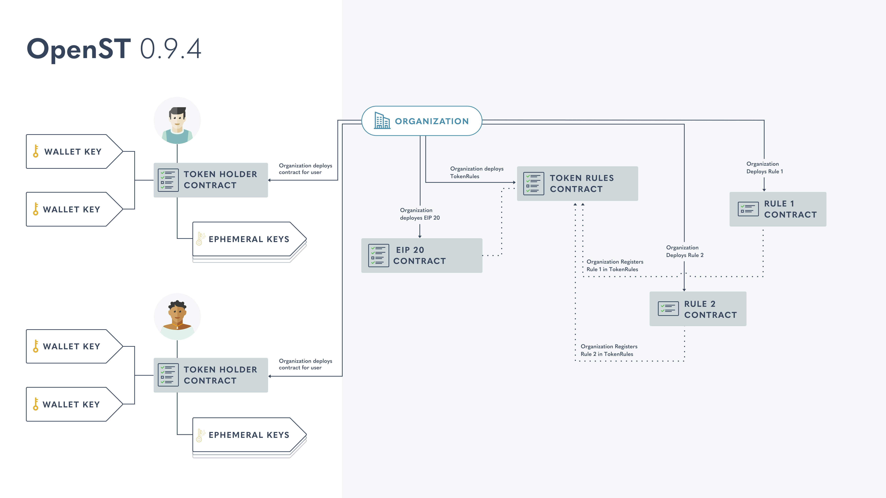

<h1 align="center">OpenST - Empowering Decentralized Economies</h1>

OpenST blockchain infrastructure empowers new economies for mainstream businesses and emerging (D)Apps. The central component of this infrastructure is the OpenST Protocol, a framework for tokenizing businesses.

_While OpenST is available as-is for anyone to use, we caution that this is early stage software and under heavy ongoing development and improvement. Please report bugs and suggested improvements._

#### Purpose

This repository houses the work that focuses on improving the usability of decentralized applications.

OpenST-contracts is a collection of smart contracts that enable developers to program Token Economies.
 

The major components of this repository are the TokenHolder contracts, TokenRules contract, and the custom Rule contracts that can be registered with the TokenRules contracts to establish the economy specific payments and rewards.
 

TokenHolder Contracts are multi-sig contracts with multiple ownership keys that are housed in different wallets that are controlled by a single human owner (say, a participant in the token economy). The multi-sig logic supports both custodial and fully decentralized key management, thus supporting a wide range of user profiles.
 

TokenRules Contract and custom Rule Contracts represent the administration functionality that enables economy managers to design intra-economy transactions that map to their business logic.

#### Diagram

#### Related Repositories

[openst.js](https://github.com/OpenSTFoundation/openst.js): OpenST.js is a library that enables interaction with openst-contracts to easily create token economies in (D)Apps. The library supports deploying and/or interacting with token, token holder, token rules, and token rule contracts.

[openst-js-examples](https://github.com/OpenSTFoundation/openst-js-examples): This repository contains an example usage of 
OpenST.js where we walk you through registering rules, adding users, adding wallets to users, revoking ephemeral keys and other functionality in the context of a token economy. In order to make the best use of openst.js, we recommend working through the example to familiarize yourself with the functionality and usage of the library.
